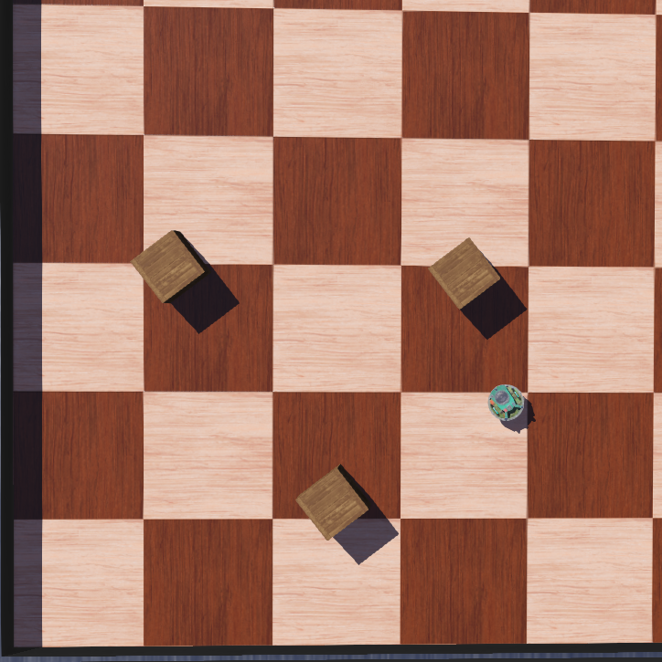
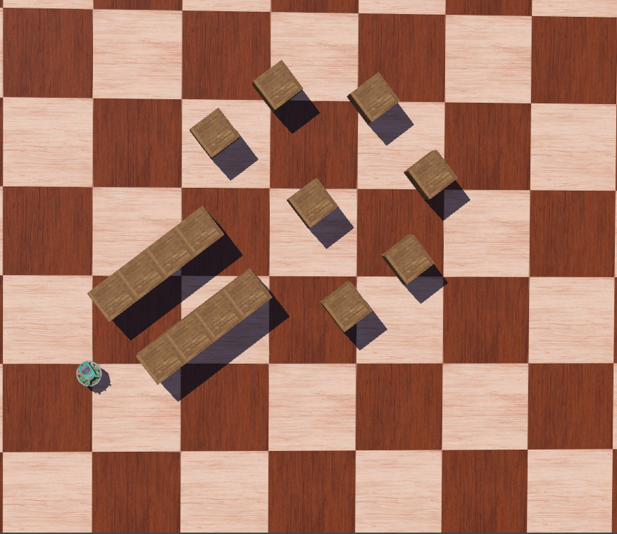
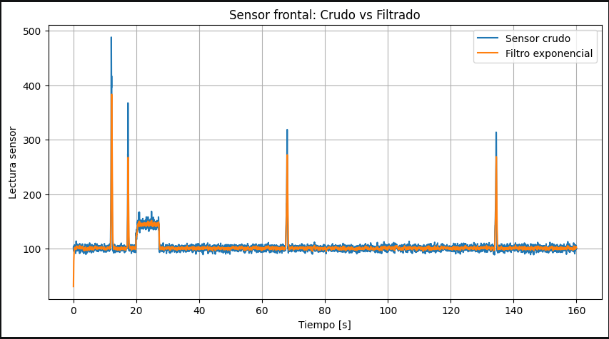
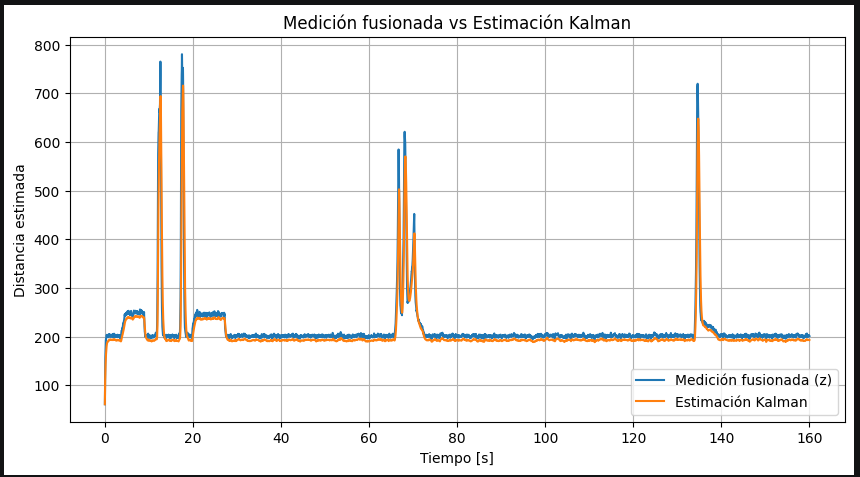
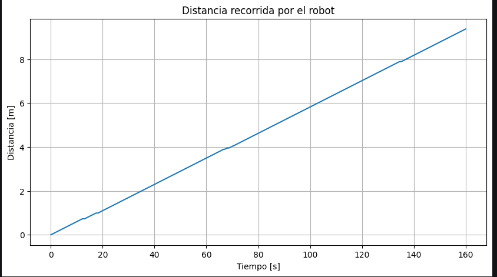

# Laboratorio 2: Navegación Reactiva y Fusión Sensorial en Webots
## Grupo

* Javier Nuñez
---
# Ejecución

1. Instalar Webots.
2. Clonar el repositorio:

```bash
git clone https://github.com/JavierNT1/lab2-navegacionreactiva.git
```

3. Abrir el mundo ubicado en:

```text
worlds/e-puck.wbt
```

4. Seleccionar el controlador:

```text
controllers/my_controller
```

5. Elegir el modo de operación modificando:

```python
USE_RAW = False
USE_FILTER = False
USE_KALMAN = True
```

activando únicamente uno de los modos por ejecución.

6. Ejecutar la simulación desde Webots.
---
## Descripción

En este laboratorio se implementó un sistema de navegación reactiva para el robot móvil diferencial **e-puck** utilizando sensores de proximidad y encoders de ruedas disponibles en Webots.

Además, se aplicaron técnicas de procesamiento de señales para mejorar la estimación de la distancia frontal a obstáculos mediante:

* Filtrado exponencial simple.
* Filtro de Kalman.
* Odometría basada en encoders.

La solución permite combinar información proveniente del movimiento del robot y de los sensores de distancia para obtener una estimación más robusta de la cercanía de obstáculos y mejorar la estabilidad de la navegación.

---

# Objetivos

* Implementar navegación reactiva basada en sensores de proximidad.
* Registrar señales provenientes de sensores y encoders.
* Estimar el desplazamiento del robot mediante odometría.
* Aplicar un filtro exponencial simple para reducir ruido.
* Implementar un filtro de Kalman para fusionar información sensorial.
* Comparar el comportamiento del robot utilizando señales crudas, filtradas y estimadas.

---

## Robot y Sensores Utilizados

Se utilizó el robot diferencial **e-puck** incluido en Webots.

### Sensores de Proximidad

El robot dispone de ocho sensores infrarrojos de proximidad:

```text
ps0  ps1  ps2  ps3  ps4  ps5  ps6  ps7
```

Estos sensores permiten detectar la presencia de obstáculos alrededor del robot mediante mediciones de distancia relativa.

Para la estimación de la distancia frontal al obstáculo más cercano se utilizaron principalmente los sensores frontales:

```text
ps0
ps7
```

La medición frontal fusionada se calculó mediante:

```text
z = ps0 + ps7
```

Adicionalmente se utilizaron sensores laterales para determinar la dirección de evasión durante la navegación reactiva:

```text
ps5  → lateral izquierdo
ps2  → lateral derecho
```

Comparando ambas lecturas fue posible decidir si el robot debía girar hacia la izquierda o hacia la derecha al detectar un obstáculo frontal.

### Encoders

Se utilizaron los sensores de posición de las ruedas:

```text
left wheel sensor
right wheel sensor
```

Los encoders entregan la posición angular acumulada de cada rueda en radianes y permiten estimar el desplazamiento recorrido por el robot mediante odometría.

---

# Frecuencia de Muestreo

La frecuencia de muestreo se obtuvo a partir del tiempo básico de simulación de Webots:

```python
Ts = timestep / 1000.0
fs = 1 / Ts
```

Valores obtenidos:

```text
Ts = 0.032 s
fs = 31.25 Hz
```
$T_s$ corresponde al tiempo de muestreo.
$f_s$ corresponde a la frecuencia de muestreo.

# Estimación del Avance mediante Encoders

La variación angular de cada rueda fue obtenida mediante los encoders.

El desplazamiento lineal de cada rueda se calculó utilizando:

```text
Δs = r · Δθ
```

donde:

- `r = 0.02 m` corresponde al radio de la rueda.
- `Δθ` corresponde al incremento angular medido.

El avance del robot se estimó mediante el promedio de ambas ruedas:

```text
Δs_robot = (Δs_izq + Δs_der) / 2
```

Posteriormente se acumuló la distancia recorrida durante toda la simulación:

```text
s_total = s_total + Δs_robot
```

---

## Filtro Exponencial

Para reducir el ruido presente en las mediciones de los sensores se implementó un filtro exponencial:

```text
y(k) = α·x(k) + (1 − α)·y(k−1)
```

donde:

- `x(k)` corresponde a la medición actual del sensor.
- `y(k)` corresponde a la señal filtrada.
- `α` corresponde al factor de suavizado.

Parámetro utilizado:

```text
alpha = 0.3
```

Este filtro suaviza las variaciones rápidas de la señal manteniendo la tendencia general de la medición.

---

# Filtro de Kalman

La variable estimada corresponde a la distancia frontal al obstáculo más cercano.

Se utilizaron los siguientes parámetros:

```python
Q = 1.0
R = 25.0
P = 100.0
```

donde:

* Q representa el ruido del modelo.
* R representa el ruido de medición.
* P representa la incertidumbre inicial.

---

## Predicción

La etapa de predicción utiliza el avance estimado mediante encoders:

```text
d_pred = d_est - Δs · 1000
```

donde:

- `d_est` corresponde a la estimación anterior.
- `Δs` corresponde al avance estimado mediante los encoders.
- `d_pred` corresponde a la distancia predicha.

---

## Corrección

La medición frontal se obtiene mediante:

```text
z = ps0 + ps7
```

donde:

- `z` corresponde a la medición fusionada de los sensores frontales.

La ganancia de Kalman se calcula mediante:

```text
K = P / (P + R)
```

donde:

- `P` corresponde a la incertidumbre de la predicción.
- `R` corresponde al ruido de medición.

Finalmente la estimación se actualiza mediante:

```text
d_est = d_pred + K · (z - d_pred)
```

donde:

- `d_est` corresponde a la estimación corregida.
- `z` corresponde a la medición de los sensores.
- `K` determina cuánto confía el filtro en la medición respecto de la predicción.
---

# Navegación Reactiva

La navegación implementada sigue la siguiente lógica:

1. Avanzar mientras no exista un obstáculo frontal.
2. Detectar obstáculos mediante sensores de proximidad.
3. Comparar sensores laterales.
4. Seleccionar la dirección de giro.
5. Mantener el giro durante varias iteraciones para evitar oscilaciones.
6. Continuar el desplazamiento una vez despejado el obstáculo.

---

# Escenarios de Prueba

## Escenario Simple


https://drive.google.com/drive/folders/1O2b5yzjs167rt5jsjnIA899ulTAUaCvE?usp=sharing

Características:

* Pocos obstáculos.
* Amplio espacio libre.
* Evaluación básica de evasión.

### Resultado RAW

El robot evitó correctamente los obstáculos, aunque presentó pequeñas correcciones de trayectoria debido al ruido de los sensores.

### Resultado FILTER

El filtrado exponencial redujo las fluctuaciones de las mediciones y produjo movimientos más suaves.

### Resultado KALMAN

La estimación mediante Kalman permitió mantener una trayectoria estable combinando sensores y odometría.

---

## Escenario Complejo


https://drive.google.com/drive/folders/1T-yydwlbLujyYyngwL3HY2VbmADCHnPb?usp=sharing

Características:

* Múltiples obstáculos.
* Pasillos estrechos.
* Mayor dificultad de navegación.

### Resultado RAW

El robot evitó obstáculos, pero presentó más correcciones de trayectoria debido a las variaciones de las mediciones.

### Resultado FILTER

La utilización del filtro exponencial disminuyó las oscilaciones y mejoró la estabilidad del movimiento.

### Resultado KALMAN

El filtro de Kalman entregó una estimación robusta de la distancia frontal y permitió una navegación estable dentro del entorno complejo.

---

# Resultados

## Señal Cruda vs Señal Filtrada



El filtro exponencial redujo significativamente las fluctuaciones presentes en la señal original manteniendo la detección de obstáculos.

---

## Medición Fusionada vs Estimación Kalman



La estimación obtenida mediante Kalman siguió la tendencia de la medición fusionada reduciendo el efecto del ruido y de las variaciones instantáneas.

---

## Distancia Recorrida



La odometría permitió estimar correctamente el desplazamiento acumulado del robot utilizando la información de los encoders.

---

# Conclusiones

* Los encoders permitieron estimar el avance del robot mediante odometría.
* El filtro exponencial redujo eficazmente el ruido presente en las mediciones de los sensores.
* El filtro de Kalman permitió fusionar información proveniente de sensores y encoders para obtener una estimación más robusta de la distancia frontal.
* La navegación reactiva permitió evitar obstáculos tanto en escenarios simples como complejos.
* Las técnicas de filtrado mejoraron la estabilidad de la trayectoria y redujeron correcciones innecesarias durante el desplazamiento.

---


